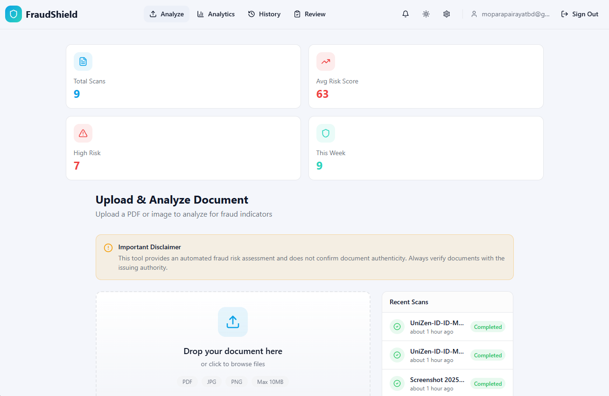

<div align="center">

# بِسْمِ ٱللّٰهِ ٱلرَّحْمٰنِ ٱلرَّحِيمِ

### *Bismillahir Rahmanir Rahim*
**In the Name of Allah, the Most Gracious, the Most Merciful**

---

# السَّلاَمُ عَلَيْكُمْ وَرَحْمَةُ اللهِ وَبَرَكَاتُهُ

### *Assalamu'alaikum warahmatullahi wabarakatuh*
**May the peace, mercy, and blessings of Allah be with you**

---


# <span style="background: linear-gradient(135deg, #0ea5e9 0%, #14b8a6 100%); -webkit-background-clip: text; -webkit-text-fill-color: transparent; background-clip: text;">🛡️ FraudShield - Document Fraud Detection Platform</span>

> **<span style="background: linear-gradient(90deg, #22d3ee 0%, #38bdf8 100%); -webkit-background-clip: text; -webkit-text-fill-color: transparent; background-clip: text;">AI-powered document fraud risk assessment</span>** built with Vite, React 18, Tailwind CSS, and Supabase

<br/>

<!-- Status Badges -->
<div>


</div>

<br/>

<!-- CTA Section -->
<div>

### 🌐 Live Demo (Coming Soon) • 📧 [Contact](#-contact) • 🔗 [Documentation](#-deployment) • 💼 [Learn More](#tech-stack)

</div>
---

## 🔐 Demo Access

No public demo credentials are provided. Run the app locally and create an account in
your own Supabase project.

---

## 📸 Screenshots

### FraudShield Dashboard (Placeholder)

<div align="center">




</div>

---

</div>

A **secure, AI-powered document fraud risk assessment platform** built for compliance teams,
operations, and analysts. Upload documents, analyze risk, and review evidence-backed flags.

#### ✅ What Makes This Special

<table>
<tr>
<td>

**Detection Engine**
- 🧠 Multi-layer AI analysis
- 🔍 OCR + field extraction
- 🧪 Metadata & visual forensics
- 🧭 Confidence scoring

</td>
<td>

**Workflow Ready**
- 📥 Secure uploads
- 🧾 Risk score & flags
- ✅ Review queue
- 📄 PDF report export

</td>
<td>

**Platform Ready**
- 🔒 Supabase auth & storage
- 📈 Analytics & history
- 🌓 Dark/Light mode
- ⚡ Fast Vite builds

</td>
</tr>
</table>

---

## <span style="background: linear-gradient(90deg, #34d399 0%, #22c55e 100%); -webkit-background-clip: text; -webkit-text-fill-color: transparent; background-clip: text;">✨ Features</span>

<table>
<tr>
<td width="33%">

### 📄 **Document Analysis**
- ✔️ PDF/JPG/PNG upload (10MB max)
- ✔️ AI-powered risk scoring
- ✔️ Fraud indicator flags
- ✔️ OCR text extraction
- ✔️ Metadata inspection

</td>
<td width="33%">

### 🧪 **Forensics & Review**
- ✔️ Visual manipulation checks
- ✔️ Consistency validation
- ✔️ Review queue for high-risk
- ✔️ Manual verify/reject flow
- ✔️ Audit logging

</td>
<td width="33%">

### 📊 **Reporting & Insights**
- ✔️ PDF export of reports
- ✔️ Scan history & filters
- ✔️ Batch uploads
- ✔️ Document comparison
- ✔️ Analytics dashboard

</td>
</tr>
</table>

<details>
<summary><b>📊 Advanced Capabilities (Click to expand)</b></summary>

#### 📈 **Analytics & Reporting**
- 📊 Risk trends over time
- 🧾 PDF report generation
- 🔎 Searchable scan history

#### 🔐 **Security & Access**
- 🔑 Supabase authentication
- 📝 Audit logging
- 🔒 Secure storage access

#### 🔔 **Notifications & Workflow**
- 📬 In-app notifications
- ✅ Review queue actions
- 🧭 Status tracking

</details>

---

## 🚀 **<span style="background: linear-gradient(90deg, #00d2fc 0%, #3a7bd5 100%); -webkit-background-clip: text; -webkit-text-fill-color: transparent; background-clip: text;">Tech Stack</span>**

<details open>
<summary><b>⚙️ Full Technology Stack (Click to expand)</b></summary>

### 🎯 Core Technologies

```
┌─ Framework & Runtime
│  ├─ Vite 5 (Build tool)
│  ├─ React 18 (UI Library)
│  ├─ TypeScript (Type Safety)
│  └─ Node.js 18+
│
├─ Styling & Design
│  ├─ Tailwind CSS 3
│  ├─ CSS Variables (Design system)
│  └─ Responsive design
│
├─ UI Components & Libraries
│  ├─ shadcn/ui + Radix UI
│  ├─ Lucide React (Icons)
│  ├─ Sonner (Toasts)
│  ├─ Recharts (Charts)
│  └─ Embla Carousel
│
├─ Backend & Services
│  ├─ Supabase (Auth + DB + Storage)
│  └─ Edge Functions (document analysis)
│
├─ State & Data Management
│  ├─ TanStack Query
│  ├─ React Hook Form
│  ├─ Zod (Validation)
│  └─ Context API
│
├─ Reporting
│  └─ jsPDF (PDF report export)
│
└─ Deployment & Hosting
   ├─ Vercel
   └─ Netlify
```

### 📦 Key Dependencies

| Category | Package | Purpose |
|----------|---------|---------|
| **Build** | `vite@5` | Fast build tool |
| **UI** | `react@18` | User interface |
| **Styling** | `tailwindcss@3` | CSS framework |
| **Forms** | `react-hook-form` | Form management |
| **Validation** | `zod` | Data validation |
| **Backend** | `@supabase/supabase-js` | Backend service |
| **Data** | `@tanstack/react-query` | Data fetching |
| **Charts** | `recharts` | Visualizations |
| **Reports** | `jspdf` | PDF export |

</details>

---

## 📁 Project Structure

```
doc-trust-ai/
├── 📂 src/                              # Source code
│   ├── 📂 components/                   # React components
│   ├── 📂 contexts/                     # Auth and app context
│   ├── 📂 hooks/                        # Custom hooks
│   ├── 📂 integrations/                 # Supabase client/types
│   ├── 📂 lib/                          # Utilities and analysis logic
│   ├── 📂 pages/                        # Route pages
│   ├── App.tsx                          # App routes
│   └── main.tsx                         # Entry point
│
├── 📂 public/                           # Static assets
├── 📂 supabase/                         # Supabase configuration
│   └── functions/                       # Edge functions
├── 📋 Configuration Files
│   ├── vite.config.ts                   # Vite configuration
│   ├── tailwind.config.ts               # Tailwind config
│   ├── tsconfig.json                    # TypeScript config
│   ├── postcss.config.js                # PostCSS config
│   └── package.json                     # Dependencies
│
└── 📄 Documentation
    └── README.md                        # Main documentation
```

---

## 🚀 Getting Started

### ✅ Prerequisites

Ensure you have these installed:

```bash
Node.js 18+  •  npm  •  Git
```

**Verify versions:**
```bash
node --version   # Should be v18.0.0 or higher
npm --version    # 8.0.0+
```

### 🔧 Installation & Setup

#### Step 1️⃣ Clone Repository
```bash
git clone <YOUR_GIT_URL>
cd doc-trust-ai
```

#### Step 2️⃣ Install Dependencies
```bash
npm install
```

#### Step 3️⃣ Environment Setup
```bash
# Create a .env file in the project root (if it doesn't exist)
# Add your API keys
VITE_SUPABASE_URL=your_supabase_url
VITE_SUPABASE_PUBLISHABLE_KEY=your_anon_key
```

#### Supabase Edge Function Environment

Set these in your Supabase project (Edge Functions):

```bash
SUPABASE_URL=your_supabase_url
SUPABASE_SERVICE_ROLE_KEY=your_service_role_key
LOVABLE_API_KEY=your_ai_provider_key
```

### ▶️ Running the Project

**Start development server:**
```bash
npm run dev
```

**Output:**
```
  VITE v5.x.x  ready in 300 ms

  ➜  Local:   http://localhost:8080/
  ➜  press h to show help
```

🎉 **Open** [http://localhost:8080](http://localhost:8080) in your browser!

---

## 🎨 Customization Guide

### 🎯 Theme & Branding

Edit design tokens in `src/index.css` or adjust theme values in `tailwind.config.ts`.

### 📝 Content Customization

You can adjust:
- App name and marketing copy
- Risk thresholds and labels
- Feature visibility and onboarding
- Supabase schema and storage rules

### ⚡ Performance Optimization

- Enable code splitting with lazy routes
- Optimize large documents before upload
- Monitor Supabase bandwidth/limits

### ✨ Add New Features

**Create a new module:**
```bash
mkdir -p src/components/NewFeature
touch src/components/NewFeature/index.tsx
```

**Component template:**
```tsx
interface Props {
  // Define props
}

export function NewFeature({}: Props) {
  return (
    <div>
      {/* Your component */}
    </div>
  );
}
```

---

## 🚀 Deployment

### 🔥 Deploy to Vercel (Recommended)

**Easiest & Fastest Method:**

1. **Push to GitHub**
   ```bash
   git push origin main
   ```

2. **Go to [vercel.com](https://vercel.com)**
   - Sign in with GitHub
   - Click "New Project"
   - Select your repository
   - Vercel auto-detects Vite

3. **Click Deploy**
   ```
   ✨ Your site is live!
   ```

### 📦 Other Deployment Options

**Netlify:**
```bash
npm run build
netlify deploy --prod --dir=dist
```

**Docker Deployment:**
```dockerfile
FROM node:18-alpine
WORKDIR /app
COPY package*.json ./
RUN npm ci --only=production
COPY dist ./dist
EXPOSE 8080
CMD ["npm", "run", "preview"]
```

---

## 📝 Available Scripts

| Command | Purpose |
|---------|---------|
| `npm run dev` | Start dev server |
| `npm run build` | Build for production |
| `npm run build:dev` | Build in dev mode |
| `npm run preview` | Preview production build |
| `npm run lint` | Run ESLint |

---

## 🤝 Contributing

We welcome contributions! Here's how:

### 📝 Process

1. **Fork** the repository
2. **Clone** your fork locally
3. **Create** a feature branch: `git checkout -b feature/awesome-feature`
4. **Make** your changes
5. **Commit**: `git commit -m "feat: add awesome feature"`
6. **Push**: `git push origin feature/awesome-feature`
7. **Submit** a Pull Request

### 📏 Code Standards

- ✅ Use **TypeScript**
- ✅ Follow **ESLint** rules
- ✅ Keep components **focused**
- ✅ Write meaningful **commit messages**

---

## 📄 License

**Proprietary License** - All rights reserved.

This project is proprietary software. Unauthorized copying or distribution is prohibited.

---

## <span style="background: linear-gradient(135deg, #22d3ee 0%, #38bdf8 100%); -webkit-background-clip: text; -webkit-text-fill-color: transparent; background-clip: text;">📧 Contact</span>

<div align="center">

### 🌍 **Let's Connect**

**Reach out across multiple channels:**

---

#### 🌐 **Global Presence**

[](mailto:Support@moparapairayat.com)
[](https://moparapairayat.com)
[](https://moparapairayat.uk)
[](https://moparapairayat.bd)
[](https://moparapairayat.sa)
[](https://moparapairayat.tr)

---

### 📍 **Regional Contact Hubs**

<table>
<tr>
<td align="center">

**🌍 Global**
- [moparapairayat.com](https://moparapairayat.com)
- 📧 [Support@moparapairayat.com](mailto:Support@moparapairayat.com)
- Int'l clients & services

</td>
<td align="center">

**🇬🇧 United Kingdom**
- [moparapairayat.uk](https://moparapairayat.uk)
- 📧 [Support@moparapairayat.uk](mailto:Support@moparapairayat.uk)
- UK-based services

</td>
<td align="center">

**🇧🇩 Bangladesh**
- [moparapairayat.bd](https://moparapairayat.bd)
- 📧 [Support@moparapairayat.bd](mailto:Support@moparapairayat.bd)
- Regional operations

</td>
<td align="center">

**🇸🇦 Saudi Arabia**
- [moparapairayat.sa](https://moparapairayat.sa)
- 📧 [Support@moparapairayat.sa](mailto:Support@moparapairayat.sa)
- ME & regional reach

</td>
<td align="center">

**🇹🇷 Turkey**
- [moparapairayat.tr](https://moparapairayat.tr)
- 📧 [Support@moparapairayat.tr](mailto:Support@moparapairayat.tr)
- Turkish & EU services

</td>
</tr>
</table>

---

### 💼 **Quick Links**

<table>
<tr>
<td>

| Platform | Link |
|----------|------|
| 📧 **Email** | [Support@moparapairayat.com](mailto:Support@moparapairayat.com) |
| 🌐 **Portfolio** | [Live Demo](https://sultan-personal-portfolio-islamic.vercel.app/) |
| 💼 **GitHub** | [Moparapairayat](https://github.com/Moparapairayat) |
| 🔗 **LinkedIn** | [Profile](https://linkedin.com/in/your-profile) |

</td>
</tr>
</table>

---

### 📧 **Official Business Emails**

**Always Active for Contracts & Inquiries:**

<table>
<tr>
<td width="50%">

[Moparapairayat@gmail.com](mailto:Moparapairayat@gmail.com)
→ General contracts

</td>
<td width="50%">

[Moparapairayatbd@gmail.com](mailto:Moparapairayatbd@gmail.com)
→ Bangladesh inquiries

</td>
</tr>
</table>

---

### 💬 **WhatsApp Project Inquiry Lines**

<table>
<tr>
<td align="center">

**🇺🇸 Personal Projects**
[+1 724-315-5810](https://wa.me/17243155810)

</td>
<td align="center">

**💼 Corporate/Large**
[+1 719-680-2913](https://wa.me/17196802913)

</td>
</tr>
<tr>
<td align="center">

**🤖 ML & AML**
[+8801955000704](https://wa.me/8801955000704)

</td>
<td align="center">

**🔒 Security & Servers**
[+8801305868621](https://wa.me/8801305868621)

</td>
</tr>
</table>

---

### 🚀 **Let's Build Something Great Together!**

Whether you have a project idea, need consultation, or just want to connect, reach out through any channel above.

</div>

---

## 📊 Project Statistics

<div align="center">

<table>
<tr>
<td>

⭐ **Stars**
Show your support!

</td>
<td>

🍴 **Forks**
Your contributions

</td>
<td>

👥 **Contributors**
Building together

</td>
<td>

📈 **Growth**
Join the community!

</td>
</tr>
</table>

**[Give a Star ⭐](https://github.com/Moparapairayat/Advanced-University-Management-System) if you found this helpful!**

---


### Made with ❤️ by **FraudShield { MOPARA PAIR AYAT }**

*Building safer document workflows with AI.*

</div>
